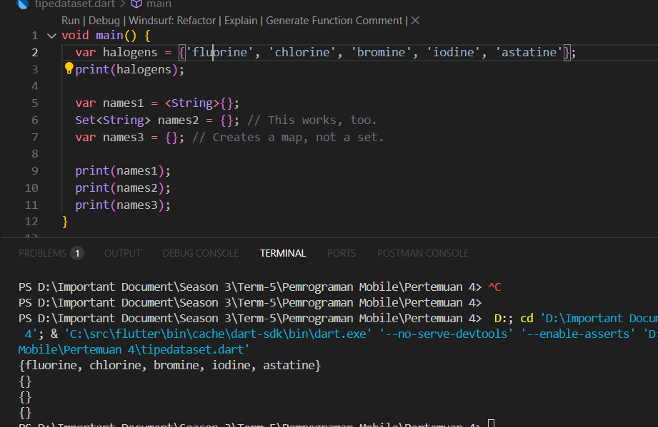

Laporan Praktikum Pemrograman Dart

Topik: Penggunaan List di Dart

## Praktikum 1

1. Kode awal

**Penjelasan:** Pada kode awal, list dibuat dengan `var list = [1, 2, 3];` sehingga langsung berisi tiga elemen. Program memeriksa panjang list dan isi indeks ke-1, lalu menampilkannya. Setelah itu elemen pada indeks ke-1 diubah dari angka 2 menjadi 1, dan hasil perubahan ini juga ditampilkan. Dari kode ini terlihat bahwa list dapat diakses lewat indeks dan elemennya bisa diganti sesuai kebutuhan, meskipun panjang list tetap sama dengan jumlah elemen awal.

2. Kode list final

**Penjelasan:** Pada kode modifikasi, list dideklarasikan dengan `final` dan dibuat menggunakan `List<String?>.filled(5, null, growable: false);`. Dengan cara ini list memiliki panjang tetap lima, semua elemennya bernilai null pada awalnya, dan hanya isinya yang bisa diubah. Indeks ke-1 kemudian diisi dengan nama, sedangkan indeks ke-2 diisi dengan NIM. Saat dicetak, list akan menampilkan `[null, Dhanil Haq, 12345678, null, null]`. Hal ini menunjukkan bahwa list dapat digunakan untuk menampung data yang lebih terstruktur dengan panjang tetap dan nilai default null.

## Praktikum 2

1. Kode awal Set halogen
   
   **Penjelasan:** Pada kode ini dibuat sebuah Set berisi lima unsur halogen: fluorine, chlorine, bromine, iodine, dan astatine. Ketika dijalankan, program menampilkan semua elemen Set tersebut. Tidak terjadi error karena deklarasi `var halogens = {...};` secara otomatis dikenali sebagai Set, sehingga hasil eksekusi menampilkan daftar elemen halogen dengan urutan yang tidak harus sama seperti saat dideklarasikan, karena Set tidak menjamin urutan.

2. Kode percobaan Set dan Map
   
   **Penjelasan:** Pada langkah ini dibuat tiga variabel, yaitu `names1` dengan deklarasi `var names1 = <String>{};`, kemudian `names2` dengan deklarasi `Set<String> names2 = {};`, dan `names3` dengan deklarasi `var names3 = {};`. Dua variabel pertama (`names1` dan `names2`) dikenali sebagai Set kosong bertipe String, sedangkan `names3` bukan Set melainkan sebuah Map kosong. Jika program dijalankan tanpa perubahan, hasil cetakan akan memperlihatkan `{}` untuk `names1` dan `names2` yang artinya Set kosong, serta `{}` untuk `names3` yang diartikan sebagai Map kosong.

## Praktikum 3

1. Kode awal Map
   
   **Penjelasan:** Pada kode awal, dibuat dua buah Map. Variabel `gifts` berisi pasangan key bertipe String dengan value berupa objek dinamis, sedangkan variabel `nobleGases` berisi pasangan key bertipe int dengan value berupa objek dinamis juga. Ketika dijalankan, program menampilkan isi dari kedua Map tersebut. Pada `gifts` terlihat bahwa key `"fifth"` diisi dengan angka 1, sedangkan pada `nobleGases` key `18` juga diisi dengan angka 2. Meskipun tipe value tidak konsisten (ada String dan ada int), Dart tetap mengeksekusi kode tersebut tanpa error karena tidak diberikan batasan tipe secara eksplisit.

2. Kode modifikasi Map dengan mhs1 dan mhs2
   
   **Penjelasan:** Setelah kode awal dijalankan, ditambahkan deklarasi dua variabel Map baru yaitu `mhs1` dengan tipe `Map<String, String>` dan `mhs2` dengan tipe `Map<int, String>`. Pada bagian ini, isi `gifts` diperbarui dengan mengganti nilai key `"fifth"` menjadi `"golden rings"`, dan isi `nobleGases` juga diperbarui dengan mengganti nilai key `18` menjadi `"argon"`. Selanjutnya `mhs1` dan `mhs2` dapat digunakan untuk menyimpan data mahasiswa. Pada `mhs1`, elemen nama dan NIM ditambahkan dengan key berupa String. Sedangkan pada `mhs2`, data ditambahkan dengan key berupa angka, misalnya `1` untuk NIM.

## Praktikum 4

1. Kode awal
   
   **Penjelasan:** Pada kode awal, terjadi error karena variabel yang dipanggil adalah `list1` sedangkan yang dideklarasikan hanya `list`. Setelah diperbaiki dengan mencetak `list`, program berjalan normal dan list baru `list2` berhasil dibuat menggunakan spread operator `...` yang menyalin elemen-elemen dari list pertama.

2. Kode spread dengan null-aware
   
   **Penjelasan:** Variabel list tambahan berisi NIM digabungkan menggunakan spread operator. Hal ini menunjukkan bahwa spread operator tidak hanya menyalin elemen, tetapi juga memudahkan penggabungan data baru ke dalam list. 

3. Kode dengan conditional collection element
   
   **Penjelasan:** Pada kode ini digunakan `if (promoActive) 'Outlet'`. Jika `promoActive = true`, maka `'Outlet'` masuk ke dalam list, sedangkan jika `false`, elemen tersebut tidak ditambahkan. Fitur ini membuat list bersifat dinamis menyesuaikan kondisi.

4. Kode dengan pattern matching case
   
   **Penjelasan:** Pada kode ini digunakan kondisi `if (login case 'Manager')`. Artinya, `'Inventory'` hanya akan ditambahkan ke dalam list apabila variabel `login` bernilai `'Manager'`. Jika kondisinya berbeda, elemen tambahan tidak muncul.

5. Kode dengan collection for
   
   **Penjelasan:** Pada kode ini digunakan `for` di dalam list, sehingga `listOfStrings` terbentuk secara langsung dari iterasi elemen `listOfInts`. Manfaat collection for adalah mempermudah pembuatan list baru dari list lama tanpa harus menulis loop secara terpisah.

## Praktikum 5

1. Kode record awal
   
   **Penjelasan:** Pada kode awal, record didefinisikan dengan elemen positional dan named. Record ini berhasil dicetak sebagai tuple berisi `('first', a: 2, b: true, 'last')`. Error sempat terjadi karena titik koma setelah `print(record)` tidak ada, namun setelah ditambahkan kode berjalan normal.

2. Kode fungsi tukar dan penggunaannya
   
   **Penjelasan:** Fungsi `tukar()` dibuat untuk menerima record `(int, int)` lalu mengembalikan record baru dengan posisi kedua nilainya ditukar. Saat dipanggil di `main()`, nilai record awal `(10, 20)` berubah menjadi `(20, 10)`. Dari sini terlihat bahwa record dapat diperlakukan seperti tuple yang mudah diakses dan dimanipulasi.

3. Kode record mahasiswa
   
   **Penjelasan:** Record dengan tipe `(String, int)` awalnya tidak bisa langsung dicetak karena belum diinisialisasi, sehingga perlu diberi nilai terlebih dahulu. Setelah diisi dengan nama dan NIM, record `mahasiswa` berhasil menampilkan data sesuai. Hal ini menunjukkan bahwa record dapat digunakan untuk menyimpan data sederhana seperti identitas.

4. Kode record mahasiswa2 dengan akses field
   
   **Penjelasan:** Record `mahasiswa2` memiliki campuran positional dan named field. Field positional dapat diakses dengan `$1` dan `$2`, sedangkan named field dapat diakses langsung dengan nama seperti `.a` atau `.b`. Setelah salah satu field diganti dengan nama dan NIM, hasil cetakan menampilkan data yang sudah diperbarui.


## Pertanyaan Praktikum

**1. Jelaskan yang dimaksud Functions dalam bahasa Dart!**
Function dalam bahasa Dart adalah sebuah blok kode yang memiliki tugas tertentu dan dapat dipanggil berulang kali. Dengan menggunakan function, program menjadi lebih terstruktur, mudah dibaca, serta menghindari penulisan kode yang berulang.

**2. Jelaskan jenis-jenis parameter di Functions beserta contoh sintaksnya!**
Dart mendukung beberapa jenis parameter, yaitu:

* **Positional parameter**: parameter yang urutannya harus sesuai saat pemanggilan.
* **Optional parameter**: parameter yang sifatnya opsional, biasanya ditandai dengan tanda kurung siku.
* **Named parameter**: parameter yang dipanggil menggunakan nama, dapat dibuat wajib dengan kata kunci `required`.

Contoh:

```dart
void contohPositional(String nama, int umur) {}
void contohOptional(String nama, [int? umur]) {}
void contohNamed({required String nama, int? umur}) {}
```

**3. Jelaskan maksud Functions sebagai first-class objects beserta contoh sintaknya!**
Functions sebagai first-class objects berarti function di Dart dapat diperlakukan seperti objek lain. Function bisa disimpan dalam variabel, dikirim sebagai argumen, atau dikembalikan oleh function lain.

Contoh:

```dart
void sapa(String nama) => print("Halo $nama");
var fn = sapa; 
fn("Dhanil");
```

**4. Apa itu Anonymous Functions? Jelaskan dan berikan contohnya!**
Anonymous function adalah function yang tidak memiliki nama. Function ini biasanya digunakan saat hanya diperlukan sekali atau ketika ingin dikirim sebagai argumen

Contoh:

```dart
var data = ['a', 'b', 'c'];
data.forEach((item) {
  print(item);
});
```

**5. Jelaskan perbedaan Lexical scope dan Lexical closures! Berikan contohnya!**
Lexical scope adalah aturan yang menentukan di mana sebuah variabel dapat diakses, berdasarkan tempat variabel tersebut dideklarasikan. Sedangkan lexical closure adalah kemampuan sebuah function untuk “mengingat” variabel di lingkup (scope) luar meskipun function tersebut sudah dijalankan di luar lingkup aslinya.

Contoh:

```dart
void main() {
  var x = 10;

  void tampilkan() {
    print(x); 
  }

  tampilkan();
}
```

**6. Jelaskan dengan contoh cara membuat return multiple value di Functions!**
Dart memungkinkan pengembalian lebih dari satu nilai menggunakan record. Dengan record, beberapa nilai dapat dikembalikan sekaligus dari sebuah function.

Contoh:

```dart
(String, int) dataMahasiswa() {
  return ("Dhanil", 12345);
}

void main() {
  var (nama, nim) = dataMahasiswa();
  print("$nama - $nim");
}
```
