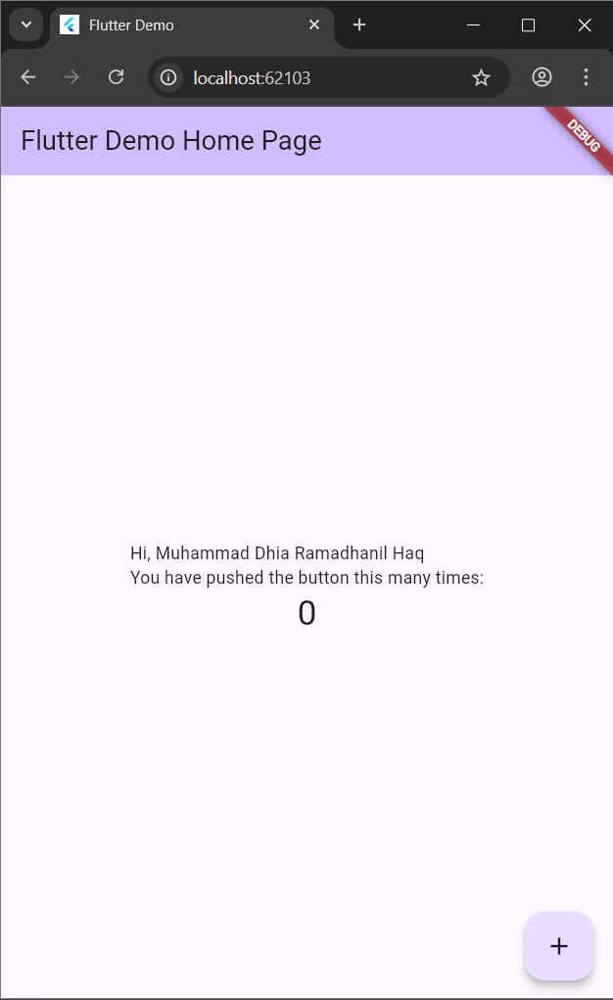
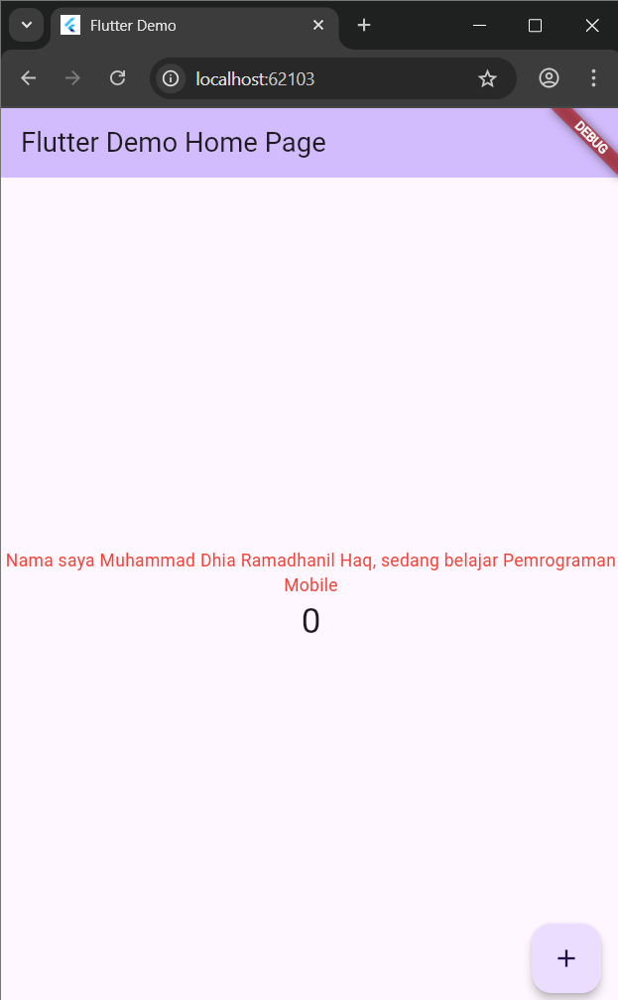
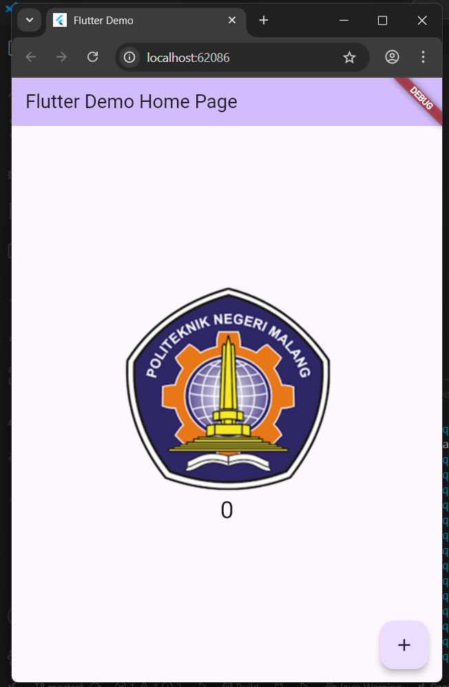
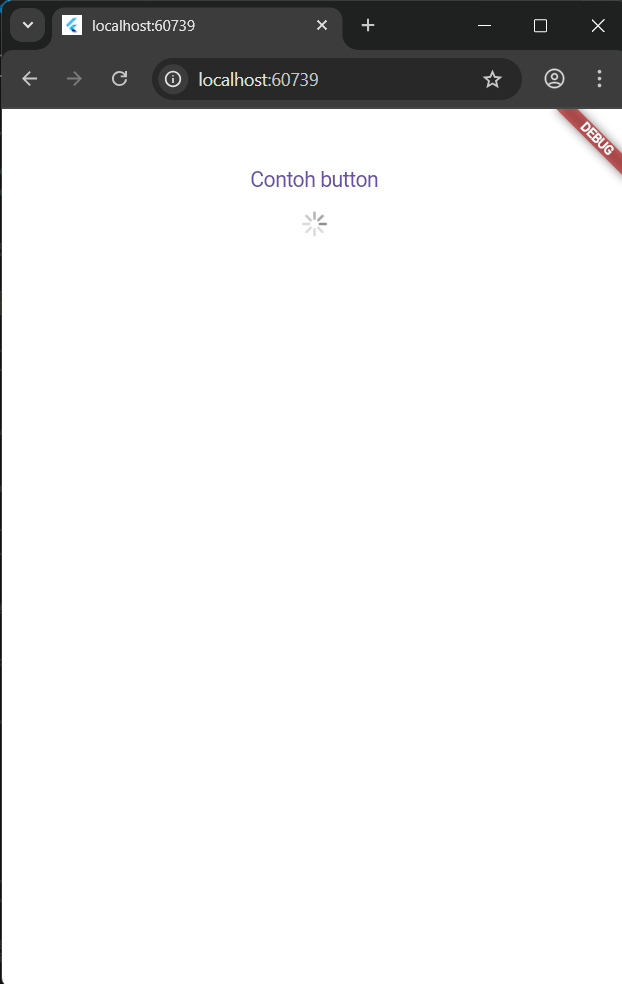
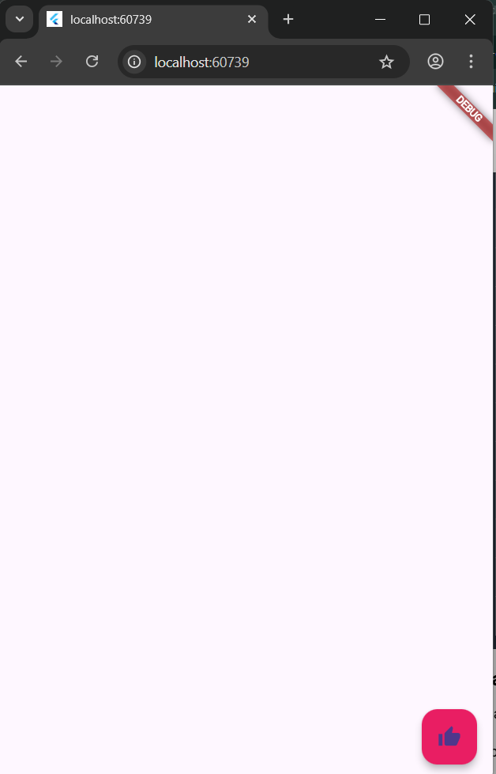
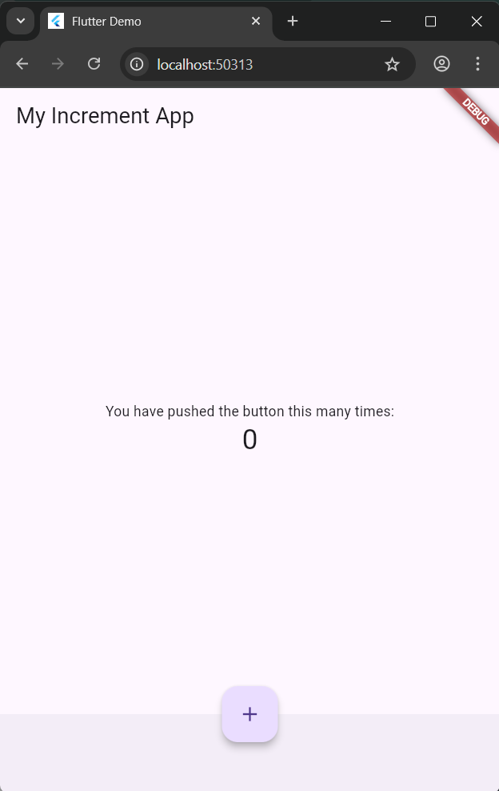
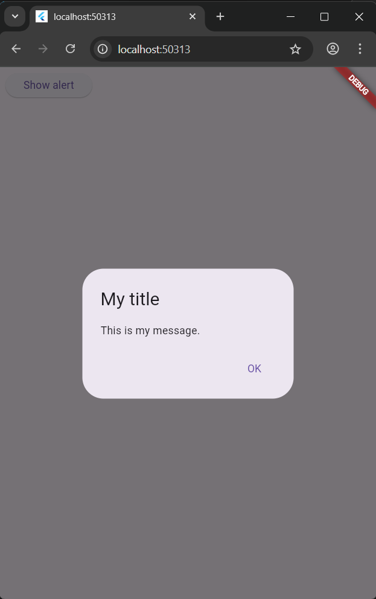
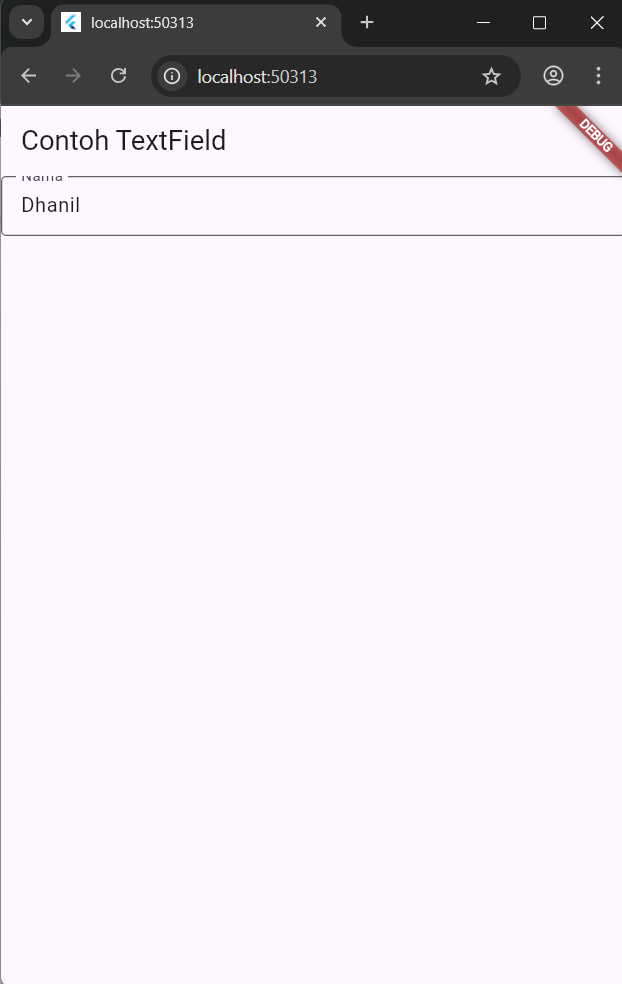
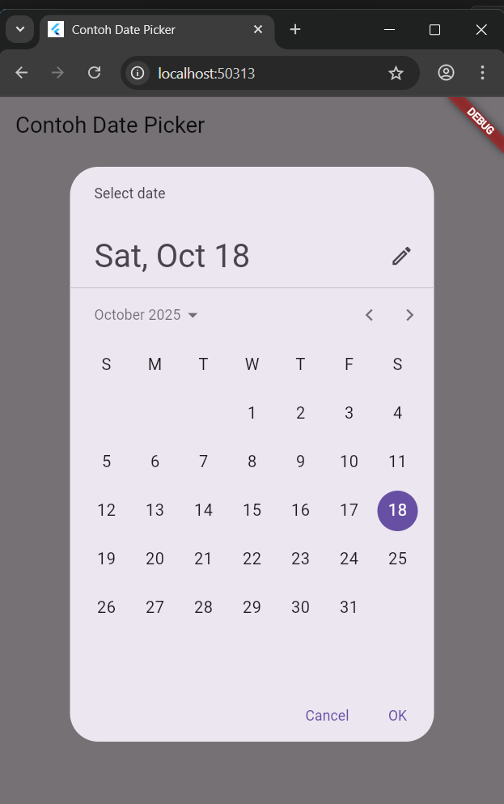

# hello_world

A new Flutter project.
1. Screenshot Aplikasi Pertama Flutter

2. Praktikum Text Widget

3. Praktikum Image Widget

4. Praktikum Cupertino Button

5. Praktikum Floating Action Button

6. Praktikum Scaffold Widget

7. Praktikum Dialog Widget

8. Praktikum Input dan Selection Widget

9. Praktikum Date and Time Picker

## Getting Started

This project is a starting point for a Flutter application.

A few resources to get you started if this is your first Flutter project:

- [Lab: Write your first Flutter app](https://docs.flutter.dev/get-started/codelab)
- [Cookbook: Useful Flutter samples](https://docs.flutter.dev/cookbook)

For help getting started with Flutter development, view the
[online documentation](https://docs.flutter.dev/), which offers tutorials,
samples, guidance on mobile development, and a full API reference.
